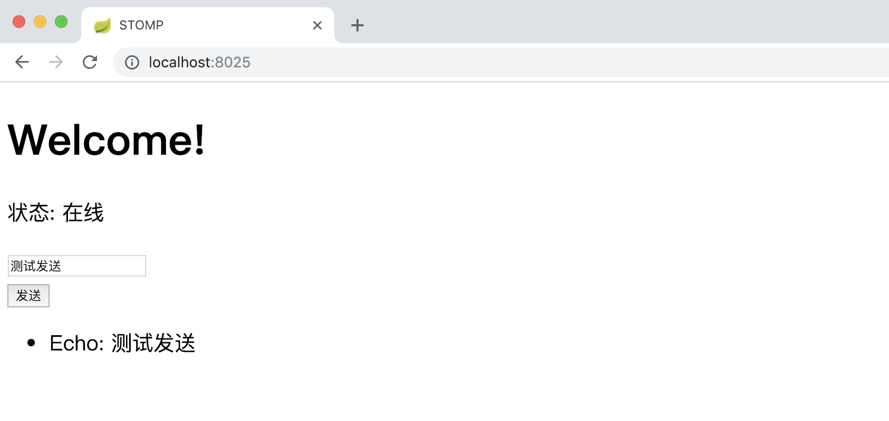

# WebSocket 脚手架项目

使用 **STOMP over SockJS** 实现的 SpringBoot 脚手架项目，可用于**快速搭建 WebSocket 工程**(支持集群)

# 使用

1. 启动项目
2. 浏览器打开 http://localhost:8025 
3. 登录 (账号: admin 密码: 123456)
4. 发送任意的文本内容，服务器将回复相同的内容并加上 Echo 前缀

效果展示: 



当收到消息时，服务端会打印当前在线人数：

> 当前本系统总在线人数: 1, 当前用户: admin, 该用户的客户端连接数: 1

# WebSocket 集群

Spring 是支持 **WebSocket 集群**的，但是网上很少有资料介绍，官方文档对于相关的配置说明也比较模糊

为此，作者查了许多资料和源码，具体配置可以查看 [WebSocketConfig类](./src/main/java/com/github/dadiyang/javastomp/config/WebSocketConfig.java)，里面有非常详细的注释说明

WebSocket 集群必须依赖**全功能的消息Broker**(full-featured message broker.)，推荐使用 RabbitMq

## 安装 RabbitMQ

具体查看 [RabbitMQ安装和集群搭建教程](./RabbitMQ安装和集群搭建教程.md)

## 配置项

```yaml
websocket:
  broker:
     use-simple-broker: false
     username: test
     password: Passw0rd
     virtualHost: "/stomp"
#    地址可配置一个或多个，当其中一个不可用时，会自动切换以保证高可用
     addresses:
      - 127.0.0.1:61613
```

# Nginx 配置

WebSocket 在连接的时候需要做一次连接升级，而 Nginx 默认是不支持连接升级的，因此如果需要使用 Nginx 做负载均衡的话，要添加以下配置

```text
location /ws{
   proxy_http_version 1.1;
   proxy_set_header Upgrade $http_upgrade;
   proxy_set_header Connection "upgrade";
   # 指定域名
   proxy_pass   域名;
   proxy_redirect off;
}
```

当然，如果不添加此配置，SockJS 会为我们自动降级，也能保证可用，但是性能会降低。

# 参考
* [Websocket Stomp Handle Broker Relay](https://docs.spring.io/spring/docs/5.1.2.RELEASE/spring-framework-reference/web.html#websocket-stomp-handle-broker-relay)
* [STOMP Protocol Specification](http://stomp.github.io/stomp-specification-1.1.html#Abstract)
* [STOMP Over WebSocket](http://jmesnil.net/stomp-websocket/doc/)
* [CentOS6和CentOS7环境下RabbitMQ安装配置和非ROOT权限启动及集群搭建最完整教程](https://blog.csdn.net/dadiyang/article/details/85774577)
* [CentOs7.3 搭建 RabbitMQ 3.6 Cluster 集群服务与使用](https://segmentfault.com/a/1190000010702020)
* [Using RabbitMQ stomp adapter to relay message across subscriptions in different servers](https://stackoverflow.com/questions/41904819/using-rabbitmq-stomp-adapter-to-relay-message-across-subscriptions-in-different/53468085#53468085)
* [What is MultiServerUserRegistry in spring websocket?
](https://stackoverflow.com/questions/43251025/what-is-multiserveruserregistry-in-spring-websocket/53631535#53631535)
* [Spring Websockets Broker relay supporting a cluster of STOMP endpoint addresses](https://github.com/spring-projects/spring-framework/issues/17057)
* [spring-framework#diff-11144739384955df1f8f38cbcde8d95b](https://github.com/spring-projects/spring-framework/commit/ffbc75ae47936c8668c55332e5b70142279f64ac#diff-11144739384955df1f8f38cbcde8d95b)